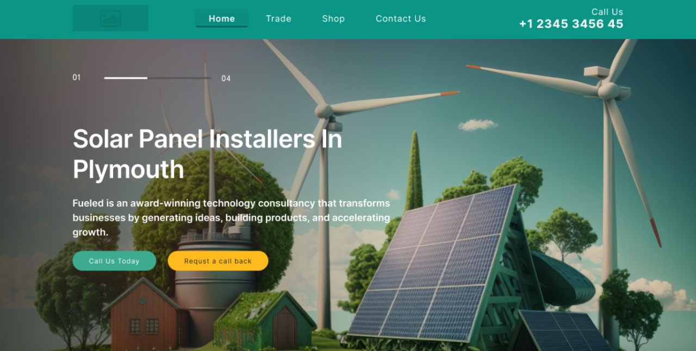

# Solar Company Landing Page



## Project Overview

A modern, responsive landing page for a solar panel company, showcasing products, services, company values, and contact options. Built using HTML and CSS with an emphasis on clean design, clear content structure, and accessibility. This is a part of my internship at Web Masters Company.

**Live Demo:** [Movie App](https://landing-page-for-solar-company-nine.vercel.app/)

- Responsive layout for mobile and desktop
- Smooth navigation with different sections
- Integrated FontAwesome icons
- Custom Google Fonts
- Call-to-action sections to encourage user engagement
- Clear structure for scalability and future expansion

## Technologies Used

- HTML5
- CSS3
- Google Fonts
- Font Awesome

## Project Structure
```
landing-page-for-solar-company/
├── index.html
├── styles/
│   ├── main.css
│   └── all.min.css
├── images/
│   └── [images used across the website]
└── README.md
```
## Getting Started
```
git clone https://github.com/Abdelaziz-Mohammed/landing-page-for-solar-company.git
cd landing-page-for-solar-company
```
open index.html

## 👨‍💻 Author
**Eng. Abdelaziz Mohamed**

- [LinkedIn](https://www.linkedin.com/in/abdelaziz)
- [GitHub](https://github.com/Abdelaziz-Mohammed)